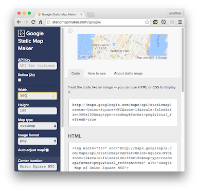

# Pokemon Go

## Base Template

- [Base Template](https://github.com/jonleung/pokemon-go/commit/5ed6a999b3f34219f27992575578f26c31355628)

## Google Static Maps API

Get a dynamically generated and hosted image of a map area from a URL.

- This
> [`http://maps.googleapis.com/maps/api/staticmap?center=New+York+City&size=300x150`](http://maps.googleapis.com/maps/api/staticmap?center=New+York+City&size=300x150)

- Generates this
> [](http://maps.googleapis.com/maps/api/staticmap?center=New+York+City&size=300x150)

### Displaying the image in HTML

```html

```

> [File](v1-google-static-maps-img-tag/index.html) |
  [Live](http://cdn.rawgit.com/jonleung/pokemon-go/672fa1d7a79d04e3cb5e3def83b1679b6e584409/v2-google-static-maps-p5/index.html) |
  [JS Bin](#TODO)

### Displaying the image in p5.js

```js
var mapImage;

function preload() {
  mapImage = loadImage("http://maps.googleapis.com/maps/api/staticmap?center=New+York+City&size=300x150")
}

function setup() {
  createCanvas(400, 200);
  background(240, 240, 240);
  image(mapImage, 0, 0);
}
```

> [File](v2-google-static-maps-p5/index.html) |
  [Live](http://cdn.rawgit.com/jonleung/pokemon-go/672fa1d7a79d04e3cb5e3def83b1679b6e584409/v2-google-static-maps-p5/index.html.html) |
  [JS Bin](#TODO)

### Static Map Maker

http://staticmapmaker.com

[](http://staticmapmaker.com)

It is an interactive playground for the Google Static Maps API. You can use
to play with the parameters.

### Full Google Static Maps API Documentation

https://developers.google.com/maps/documentation/static-maps/intro#Usage

Useful Parameters:

- `zoom`

Useful Features:

- [Style Maps](https://developers.google.com/maps/documentation/static-maps/intro#StyledMaps):
  you can change the styling of the map to make it look like Pokemon Go
  (see [Pokemon Go Screenshot](https://media4.popsugar-assets.com/files/thumbor/Sw_z2W048sv8hgWnZvVcGD-3G4w/fit-in/2048xorig/filters:format_auto-!!-:strip_icc-!!-/2016/07/12/893/n/1922507/cb5991ee0d7471c7_main.jpg))

### Adding Markers

Using [Static Map Maker](http://staticmapmaker.com/google/), try the "Add a marker"
feature:

**Generic Marker**

[`http://maps.googleapis.com/maps/api/staticmap?center=Union+Square+NYC&size=300x150&zoom=16&markers=size:mid%7Ccolor:0xff0000%7Clabel:1%7C5th+avenue+and+E+14th+Street
`](http://maps.googleapis.com/maps/api/staticmap?center=Union+Square+NYC&size=300x150&zoom=16&markers=size:mid%7Ccolor:0xff0000%7Clabel:1%7C5th+avenue+and+E+14th+Street)

> [
](http://maps.googleapis.com/maps/api/staticmap?center=Union+Square+NYC&size=300x150&zoom=16&markers=size:mid%7Ccolor:0xff0000%7Clabel:1%7C5th+avenue+and+E+14th+Street)

**Custom Image Marker**

[`http://maps.googleapis.com/maps/api/staticmap?center=Union+Square+NYC&size=300x150&zoom=16&markers=icon:http://i.imgur.com/3Jk4mkU.png%7Cshadow:true%7C5th+avenue+and+E+14th+Street
`](http://maps.googleapis.com/maps/api/staticmap?center=Union+Square+NYC&size=300x150&zoom=16&markers=icon:http://i.imgur.com/3Jk4mkU.png%7Cshadow:true%7C5th+avenue+and+E+14th+Street)

> [
](http://maps.googleapis.com/maps/api/staticmap?center=Union+Square+NYC&size=300x150&zoom=16&markers=icon:http://i.imgur.com/3Jk4mkU.png%7Cshadow:true%7C5th+avenue+and+E+14th+Street)

## Geolocation

## License

[MIT](LICENSE)


-------------------------------------------------------------------------------

#### Obtaining a Google Maps API Key

1. Go to https://developers.google.com/maps/documentation/static-maps/
2. Click "Get a Key" and follow the directions
3. When you're asked "Accept requests from these HTTP referrers", leave it blank
